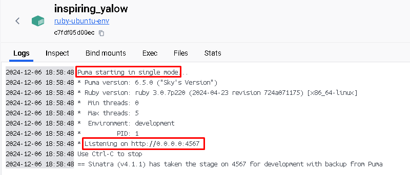
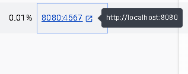

# docker-rvm-ruby-setup

Docker image that provides a comprehensive and standardized environment for running Ruby applications.

# Setup

* `docker build -t <your-image-name>`
* `docker run -p 4567:4567 <your-image-name>`
* If your app is running on other address than : 0.0.0.0 :
  * Than you run the container with this command:
    * `docker run <local-address>:<container-app-port>:<localhost-port> <image-name>`
    * `docker run -p 8080:4567 <image-name>`

## Demonstration

